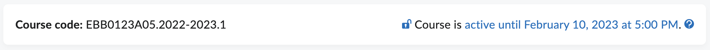

# Course Info widget

The Course Info widget shows the course offering code and whether the course is currently available
to students.

_Screenshot of the Course Info widget_

The active status is only visible for users that have access to the
`/d2l/api/lp/(version)/courses/(orgUnitId)` endpoint of the Brightspace API: mostly just lecturers,
teaching assistants and administrators. If a user does not have access, the right side of the widget
stays blank.

## Creation steps
- Create a widget in Brightspace
- Disable _Widget is Sandboxed_
- Enable _Render in IFrame_
- Set Release Conditions to _Enrolled in current org unit as the role_ (match **any**) for the roles
  that should see this widget, e.g.
  - Lecturer
  - Teaching Assistant
  - [...]
- Content: copy from [widget-CourseInfo.html](widget-CourseInfo.html) into the widget's HTML source
- Upload the files in [public/](public) to Brightspace Public Files in
  `/shared/Widgets/CourseInfo`
- Add the widget to the course homepages.

## Required modifications
The current version of the widget contains a reference to the UG's help pages on changing the
active state of the course. Replace the link (https://edusupport.rug.nl/1920991266/) in the HTML
source to point to your own resources, or remove the whole line to completely remove the link.
