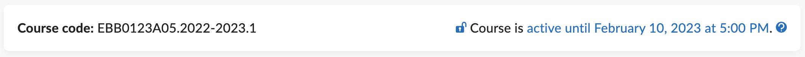
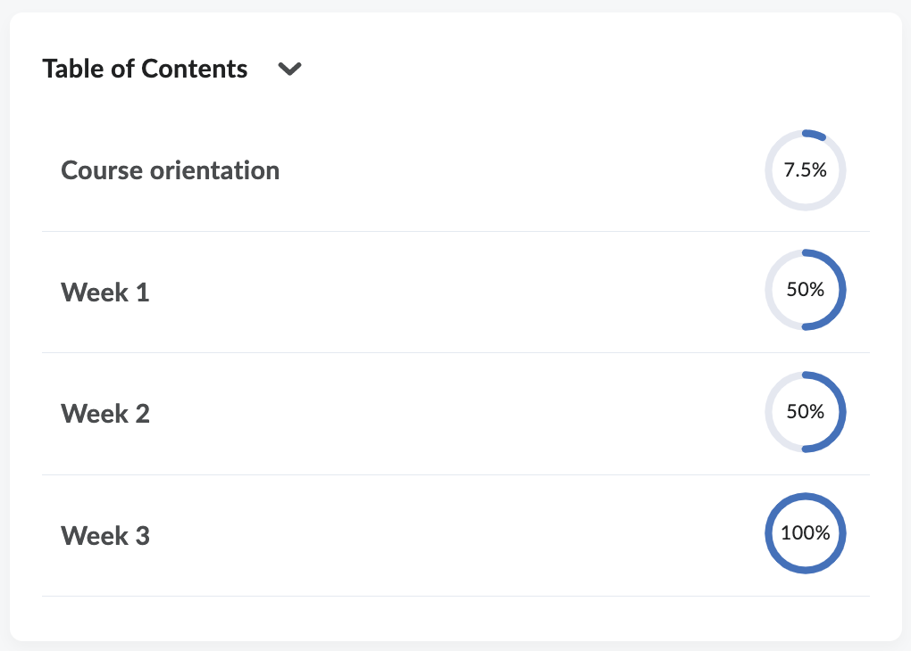

# Brightspace Widgets

The University of Groningen (UG) has created a few custom widgets. These widgets can be used by other
institutions as desired. The widgets are English by default, but have a Dutch translations.
If a user has set their profile to another language, the widgets will fall back to the English texts. 

UG is not able to actively support these widgets. In case problems arise, please check if a newer
version of the widget has already been published. If not you can create an issue, but we cannot 
guarantee these issues will be resolved by.

Setup instructions are in the Readme files for each widget.

## Course Info
The Course Info widget shows the course offering code and whether the course is currently available
to students.

_Screenshot of the Course Info widget_

[Course Info Readme](CourseInfo/README.md)

## Table of Contents
The Table of Contents widget shows an outline of the upper level of Content and is based on
the D2L Content Navigator widget. The main differences are:

- The "Last Viewed" content is not tracked
- Clicking an item will immediately open the corresponding Content item 
  instead of expanding the structure within the widget.

_Screenshot of the Table of Contents widget_

[Table of Contents Readme](TableOfContents/README.md)
