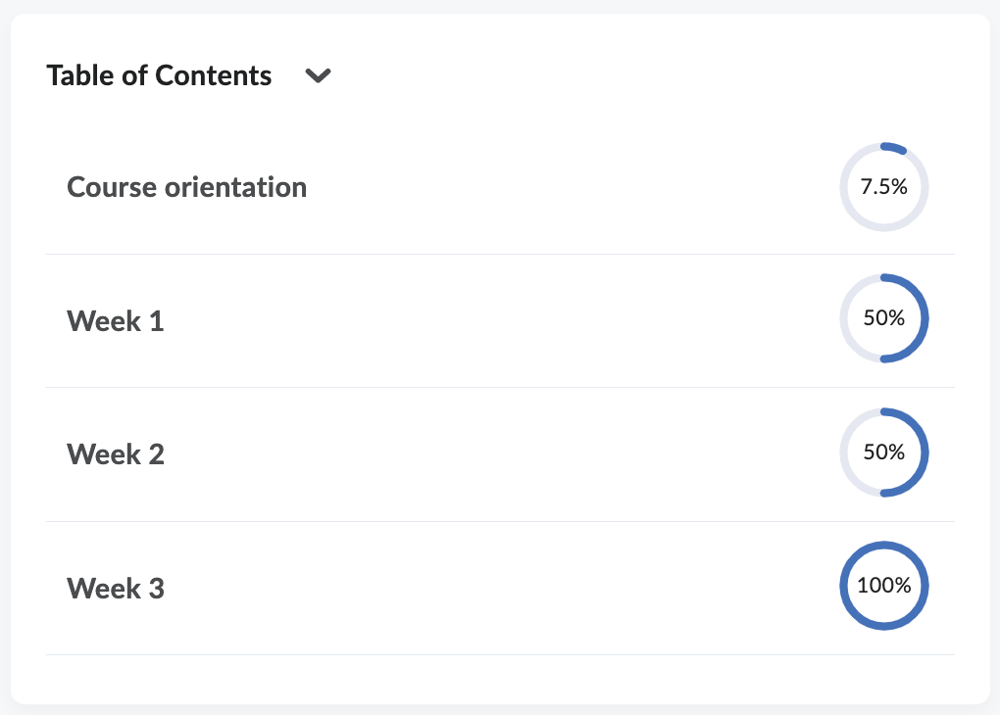

# Table of Contents widget

The Table of Contents widget shows an outline of the upper level of Content and is based on
the D2L Content Navigator widget. The main differences are:

- The "Last Viewed" content is not tracked
- Clicking an item will immediately open the corresponding Content item
  instead of expanding the structure within the widget.

_Screenshot of the Table of Contents widget_

## Creation steps
- Create a widget in Brightspace
- Disable _Widget is Sandboxed_
- Enable _Render in IFrame_
- Content: copy from [widget-TableOfContents.html](widget-TableOfContents.html) into the widget's HTML source
- Upload the files in [public/](public) to Brightspace Public Files in
  `/shared/Widgets/TableOfContents`
- Add the widget to the course homepage(s).
